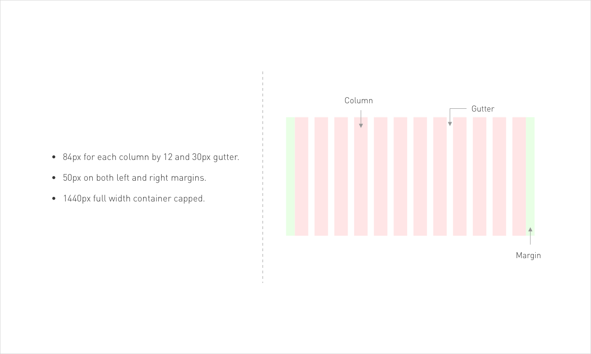

# Column
------

## Responsive

Responsive web design is an approach to web design that makes web pages render well on a variety of devices and window or screen sizes.

In this project, we will be using full width `12-col` as know as full width 12 columns grid system and screen crafting.



*A 24-column grid would be even more flexible, but more things to count.*

The reason a 12-column grid is more popular than an 8 or 10 columns grid is because of the variety of ways it can be divided: into columns of 1, 2, 3, 4, 6, or 12.

## Columns

Content is placed in the areas of the screen that contain columns.

Column width is defined using percentages, rather than fixed values, to allow content to flexibly adapt to any screen size. The number of columns displayed in the grid is determined by the breakpoint range (a range of predetermined screen sizes) at which a screen is viewed, whether it’s a breakpoint for mobile, tablet, or another size.

**Example of columns:**

```html
<div class="col-12">
    ...
</div>
```

## Gutters

Gutters are the spaces between columns. They help separate content.

Gutter widths are fixed values at each breakpoint range. To better adapt to the screen, gutter width can change at different breakpoints. Wider gutters are more appropriate for larger screens, as they create more whitespace between columns.

## Margins

Margins are the space between content and the left and right edges of the screen.

**Example of margins:**

```css
selector {
    margin: 0px 12px 0px 12px;
}
```

Margin widths are defined as fixed values at each breakpoint range. To better adapt to the screen, the margin width can change at different breakpoints. Wider margins are more appropriate for larger screens, as they create more whitespace around the perimeter of content.

## Media-screen

The @**media** rule is used in **media queries** to apply different styles for different media types/devices. **Media queries** can be used to check many things, such as: width and height of the viewport. width and height of the device. orientation (is the tablet/phone in landscape or portrait mode?)

```css
// Extra small devices (portrait phones, less than 576px)
// No media query for `xs` since this is the default in Bootstrap

// Small devices (landscape phones, 576px and up)
@media (min-width: 576px) { ... }

// Medium devices (tablets, 768px and up)
@media (min-width: 768px) { ... }

// Large devices (desktops, 992px and up)
@media (min-width: 992px) { ... }

// Extra large devices (large desktops, 1200px and up)
@media (min-width: 1200px) { ... }
```

We occasionally use media queries that go in the other direction (the given screen size or smaller):

```css
// Extra small devices (portrait phones, less than 576px)
@media (max-width: 575.98px) { ... }

// Small devices (landscape phones, less than 768px)
@media (max-width: 767.98px) { ... }

// Medium devices (tablets, less than 992px)
@media (max-width: 991.98px) { ... }

// Large devices (desktops, less than 1200px)
@media (max-width: 1199.98px) { ... }

// Extra large devices (large desktops)
// No media query since the extra-large breakpoint has no upper bound on its width
```

*Visit [here](https://getbootstrap.com/docs/4.3/layout/overview/) for more details.*