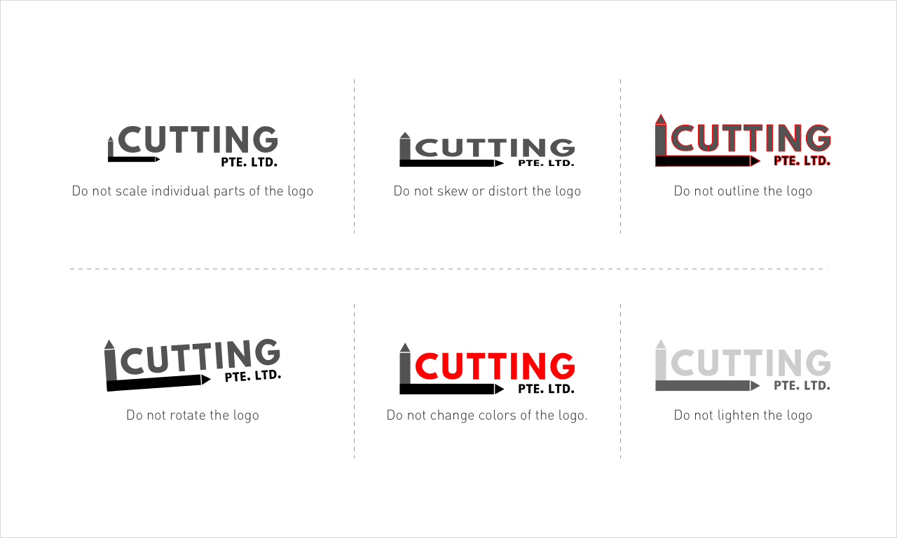

# Incorrect
------

## Misuse

In order to preserve the integrity of the brand, it is imperative that you avoid changing or distorting the logo.
Below are some examples of logo misuse.

## Additional

**More incorrect usage example:**

* Do not rearrange the order of the art.
* Do not switch colors within the logo.
* Do not reproduce the logo in low resolution.
* Do not use original logo in dark background.
* Do not use full white logo in light background.