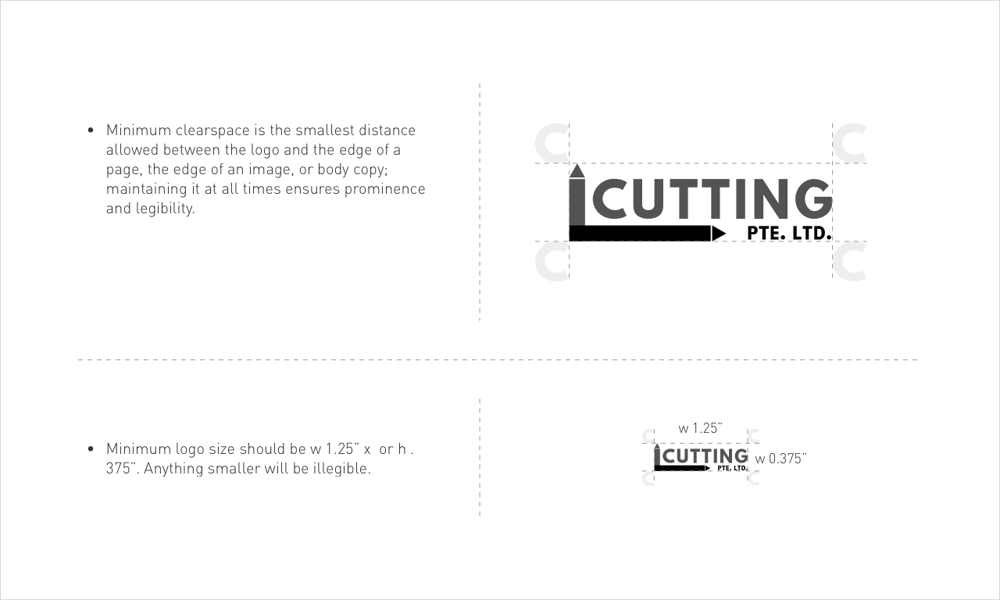

# Whitespace
------

## Exclusion

Alternatively referred to as spacing or whitespace, white space is any section of a document that is unused or space around an object. The important of whitespace around brand elements and throughout all layouts cannot be overladed. It adds confidence and clarity to the visual messaging.Whitespace also help separate paragraphs of text, graphics, and other portions of a document, and helps a document look less crowded.



Always allow a minimum space around the logo.

?> See [here](#) to download the logo.

## Minimum

The logo minimum size is `w 1.25"` x `h .375"`.

**inch to px:**

```bash
#logo {
    min-width: 120px;
    min-height: 36px;
}
```

## Maximum

There is no maximum size defined for the logo.

