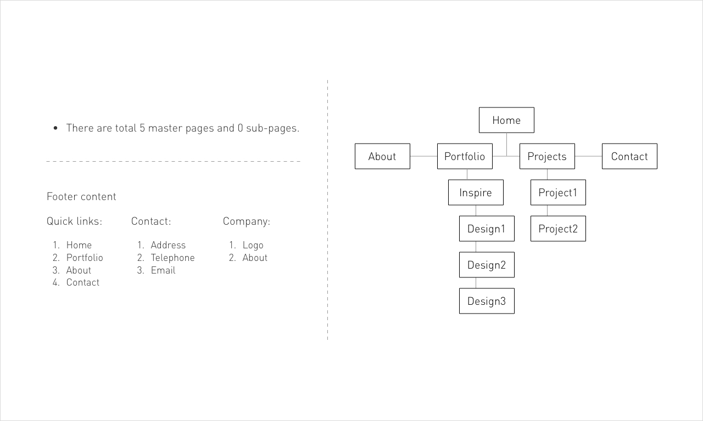

# Current
------

## Sitemap

A **sitemap** is a file where you provide information about the pages, videos, and other files on your site, and the relationships between them. Search engines like Google read this file to more intelligently crawl your site. A **sitemap** tells the crawler which files you think are important in your site, and also provides valuable information about these files: for example, for pages, when the page was last updated, how often the page is changed, and any alternate language versions of a page.

For this project, the current sitemap structure is as follows:



*Using a sitemap doesn't guarantee that all the items in your sitemap will be crawled and indexed, example as Google processes rely on complex algorithms to schedule crawling. However, in most cases, your site will benefit from having a sitemap, and you'll never be penalized for having one.*

## Directory

As for directory view, it probably looking like this:

```bash
.
└── Home
    ├── About
    ├── Portfolio
    |   └── Design inspiration
    |       ├── Design 1
    |       ├── Design 2
    |       └── Design 3
    ├── Projects
    |   ├── Project 1
    |   └── Project 2
    └── Contact 
```

For each individual directory's **URL** will be http://yourdomain.com/ as starting followed by and `/directory`:

**Top level pages:**

```bash
Home          => http://yourdomain.com/
About         => http://yourdomain.com/about
Portfolio     => http://yourdomain.com/portfolio
Projects      => http://yourdomain.com/projects
Contact       => http://yourdomain.com/contact
```