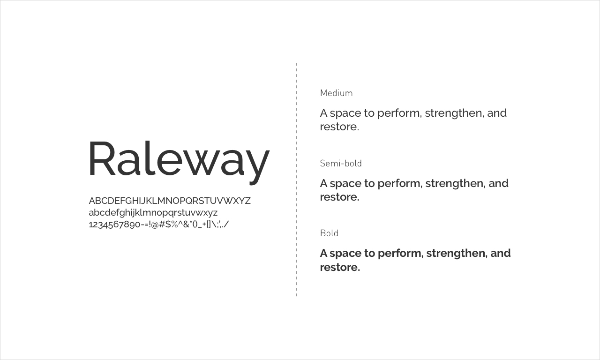

# Font-type
------

## Raleway

**Raleway** is an elegant sans-serif typeface family intended for headings and other large size usage. Initially designed by Matt McInerney as a single thin weight, it was expanded into a 9 weight family by **Pablo Impallari** and **Rodrigo Fuenzalida** in 2012 and **iKerned** by **Igino Marini**.



?> It also has a sister family, [Raleway Dots](https://fonts.google.com/specimen/Raleway+Dots).

## Download

Click [here](https://fonts.google.com/download?family=Raleway) to download the font.

If the above link not working, copy this `URL` into your browser.

```bash
https://fonts.google.com/download?family=Raleway
```

## Embed

To embed your fonts into a webpage, copy this code into the `<head>` of your HTML document.

```bash
<link href="https://fonts.googleapis.com/css?family=Raleway&display=swap" rel="stylesheet">
```

or if you with to use `@import` method, copy this code into your CSS stylesheet.

```bash
@import url('https://fonts.googleapis.com/css?family=Raleway&display=swap');
```

## Rules

Use the following CSS rules to specify these families:

```bash
font-family: 'Raleway', sans-serif;
```

For examples of how fonts can be added to webpages, see the [getting started guide](https://developers.google.com/fonts/docs/getting_started).

## More

Learn more at [theleagueofmoveabletype.com](http://www.theleagueofmoveabletype.com/) and [impallari.com](http://www.impallari.com/).

## Contribute

To contribute, see [github.com/impallari/Raleway](https://github.com/impallari/Raleway/).   